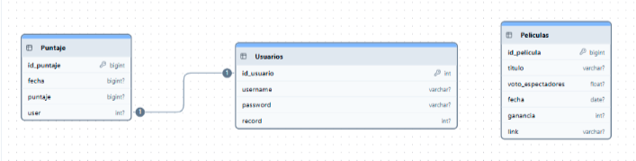

# Proyecto interdisciplinario
## Primer cuatrimestre

### Título de la propuesta: _Movie Master_
### Grupo: 05 División: 5A

### Integrantes: 
#### Julián Brianza, Juan Lucas Casanova, Francisco Pascuet, Matias Mahlknecht, y Martín Tello

### Descripción de la propuesta
Vamos a realizar un juego del género “Higher or Lower”. El juego consistirá en mostrar 2 películas y un dato
numérico sobre ella. El jugador tiene que decidirse por alguna de las 2 películas para intentar dar con la
opción correcta. Por ejemplo, elegir qué película fue estrenada antes o cuál de las 2 tuvo mejor taquilla.
Si el jugador acierta, aumentará su puntaje. Si se equivoca el juego terminará y su puntaje se guardará.
Después tendrá la opción de volver a jugar y superar su marca anterior. Cada vez que el jugador termine de
jugar podrá consultar la tabla de posiciones respecto a otros jugadores y sus puntuaciones más altas
Sistema de puntaje:
El puntaje sube 1 punto cada vez que el jugador responda correctamente.
Temática:
Decidimos que la temática del juego va a ser “Taquilla de películas”/”Puntuación IMDB”/”Runtime”; los
jugadores tendrán que adivinar la siguiente película obtuvo una mayor o menor … que la película mostrada
anteriormente.

### Bocetos de la interfaz de la aplicación
https://www.canva.com/design/DAGopN50HzQ/pbv-JQ0I4dRVu_lAJV66uw/view?utm_content=DAGopN50HzQ&amp;utm_campaign=designshare&amp;utm_medium=link2&amp;utm_source=uniquelinks&amp;utlId=h84586e767c

### Alcance
- Sistema de récords y ranking
- Rondas infinitas o que terminen cuando el usuario se equivoque
- Agregación, modificación y eliminación de películas
- Cuentas de jugador(básicas) o de administrador(con capacidad de modificar la bdd)

### Tareas

#### Base de Datos
- Pelis: Auto id - Filas en BBDD MARTIN FRAN
- Usuarios: Auto id - User - Password - MaxPuntaje MARTIN FRAN
- Puntaje: auto_id -fecha -puntaje- user(fk) MARTIN FRAN

#### Backend
- Película: Get - Post - Delete JUAN
- User: Get - Post - Put MATI
- Puntaje: GET - PUT - POST- DELETE FRAN

#### Frontend
- Fetchs JUAN
- Manejo de sesión: Login - Register - Close Sesion MATI FRAN
- Loop Jugable:
- Selección de Peli (random) JULI
- Poner UI/Reemplazar JULI
- Botones de Cambio JULI
- Comparación JULI
- Finalización JULI
- Comparación de puntos Máx( Usuario y Ranking) JULI

#### Estructura: 
- HTML MARTIN - CSS MARTIN JUAN JULI

### Responsabilidades
- Brianza FRONT(LOOP JUGABLE) - CSS
- Casanova BACK(PELÍCULA) - FRONT(FETCH) - CSS
- Mahlknecht BACK(USER) - FRONT(SESION MANAGE)
- Pascuet BDD - BACK(PUNTAJE) - FRONT(SESION MANAGE)
- Tello BDD - HTML - CSS

### Diagrama de flujo
https://app.chartdb.io/d/90faa6882525

### Diagrama Gantt
https://drive.google.com/file/d/18tynA_7MU5nwLDduG0qf7FWICn2heCwa/view

### Primer entregable
En este proyecto en particular, los entregables están definidos pero pueden aprovechar para poner como lo
van a hacer en su proyecto en particular
### Segundo entregable
### Entrega final
